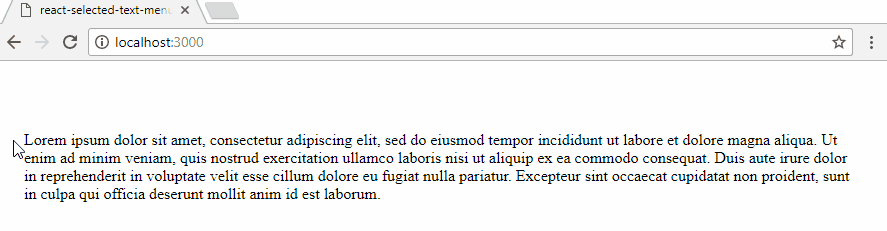

# react-selected-text-menu
Modulable menu for text selection in React

## Installation

`npm --save react-selected-text-menu`

## Introduction



## Usage

```jsx
import SelectedText from 'react-selected-text-menu';
// In the render :
<SelectedText items={['google', 'wikipedia', 'clippy']}>
  Lorem ipsum dolor sit amet
</SelectedText>
```
